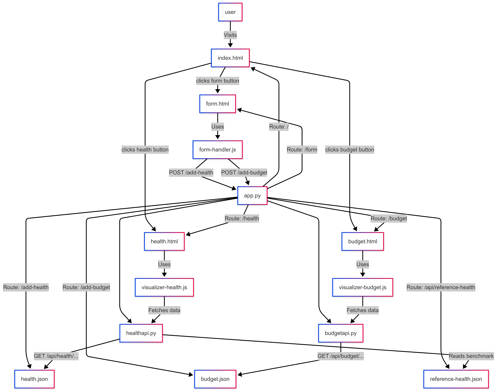
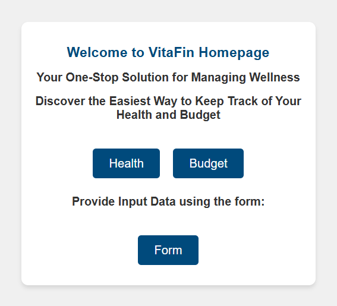
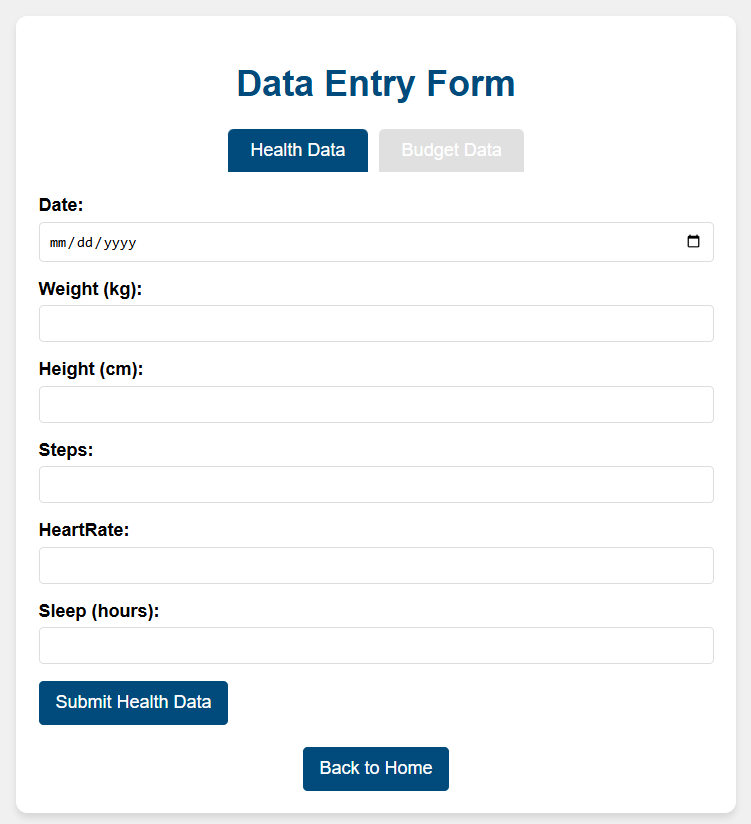
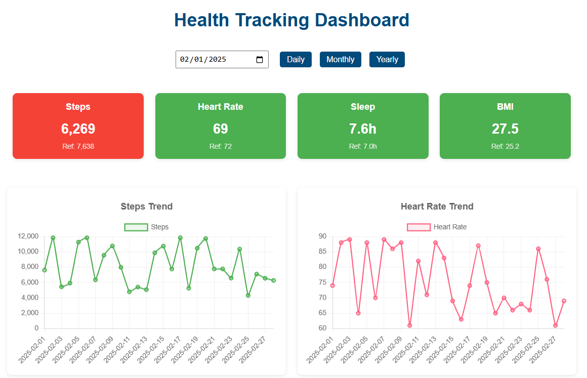
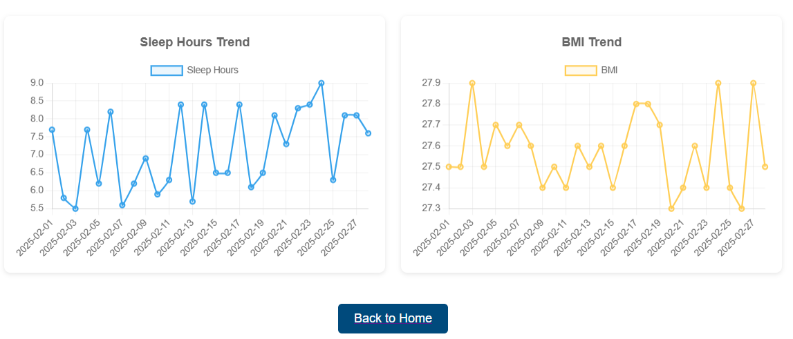
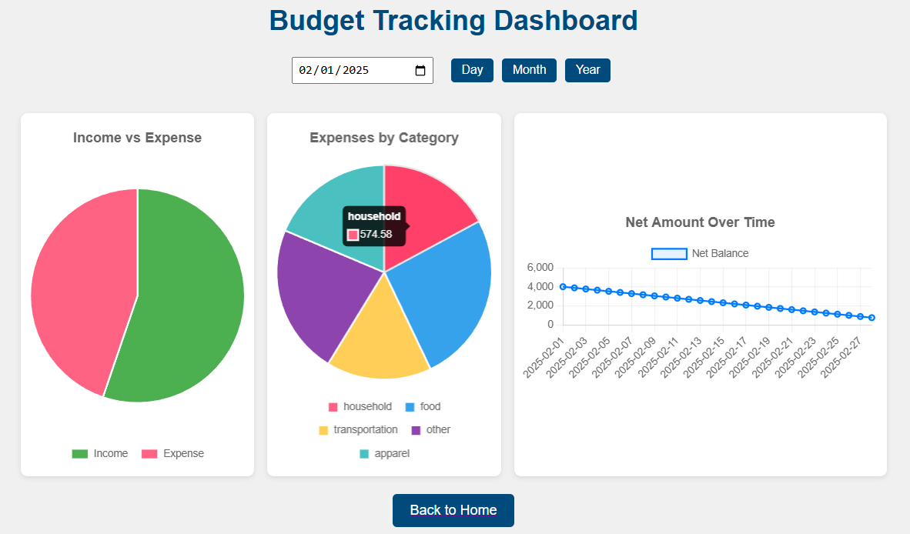

# VitaFin : Personal Health and Budget Tracker

## Introduction 
In today’s fast-paced lifestyle, maintaining a healthy balance between physical well-being and financial
stability is increasingly important, especially for students and working professionals. While many
individuals use separate apps to track their fitness and budgeting goals, there is a growing demand
for a single, integrated platform that provides a holistic view of both aspects.

VitaFin is a web-based personal health and budget tracker that addresses this need by combining
health and financial tracking into one unified dashboard. It allows users to manually log health data
(steps, heart rate, sleep hours, and BMI) and financial records (income and categorized expenses),
visualize their data through interactive charts, and monitor trends over time.

What sets VitaFin apart is its integration of benchmark comparison through the use of reference
datasets. For each health metric, users can view their personal trends alongside reference averages
derived from standard sample data. This feature helps users not only see how they are progressing
but also how they compare to healthy norms.

By leveraging Flask for the backend and modern JavaScript (like Vue.js and chart.js) on the frontend,
VitaFin provides a responsive and insightful experience tailored for self-improvement. Whether
the goal is better health or smarter budgeting, VitaFin supports users in building healthier habits
and better financial control—all in one place.

## Workflow 
- Users enter daily health and budget data via a web form
- Data is stored in JSON files (simulating a database)
- Visualizations update in real-time via API calls to the backend
- The user can select a time range and view: daily, monthly, or yearly
- Summary charts provide insights like trends, net savings, and category breakdowns
- Each health trend also includes a reference average from standard benchmark data.
- If the data varies from the benchmark by a threshold, then it is highlighted in red.

 
    

## File Structure and Description

### Frontend

- **index.html** This is the landing page of our application. It shows a welcome message and has
three buttons: ‘Health’, ‘Budget’ and ‘Form’ which are styled using CSS.

 
    

- **form.html** This file is the form page of our application. It is accessed when the user clicks the ‘Form’ button on the homepage. It has two tabs, one for Health and the other for Budget. This page allows users to enter their health and budget information using the respective tabs. 

The **Health tab** includes fields like date, weight, height, steps taken, heart rate, and sleep for that day. When the user clicks the Submit button,the data is sent to the database in JSON format. 

The **Budget tab** has fields for date, type (income or expenditure selected from a dropdown), and if ‘expenditure’ is selected, another
dropdown appears to choose the expense category like food, household, apparel, transportation, or other. It also includes fields for amount and description.

   
   
   

- **health.html** This file serves as the Health Tracking Dashboard for our application. It provides users with an interactive interface to visualize their personal health metrics over time. The page features a date picker and three view selection buttons (Daily, Monthly, Yearly) that
allow users to adjust the time range of displayed data.

- **visualizer-health.js** This JavaScript file contains the core functionality for the Health Tracking Dashboard using Chart.js. It manages data fetching, processing, and visualization of health metrics across different time periods.

   
   
   

- **budget.html** This file serves as the Budget Tracking Dashboard for our application. It allows users to interactively view their financial data through charts. The page features a date picker and three view selection buttons (Daily, Monthly, Yearly) that
allow users to adjust the time range of displayed data.

- **visualizer-budget.js** This JavaScript file defines and runs the logic for the Budget Tracking
Dashboard using Vue.js and Chart.js.

 
    

### Backend

- **app.py** The app.py file serves as the central controller for the Flask-based web application,
defining routes, registering API blueprints, and managing data flow between the front-end and
JSON-based storage.

- **healthapi.py** The healthapi.py file defines a Flask Blueprint dedicated to handling API
routes related to health data, enabling the application to serve health-related insights such as
trends in steps, heart rate, sleep hours, and BMI.

- **budgetapi.py** The budgetapi.py file defines a Flask Blueprint dedicated to handling API
routes related to the user’s budget data, enabling the application to generate financial insights
such as expense distributions, income-versus-expense comparisons, and net balance trends over
time.

- **form-handler.js** file handles the submission of user data from both the
health and budget input forms in the web application, packaging the inputs into structured
JSON and sending them to the server using fetch API calls.

### Data Files

- **health.json** This file acts as the primary data store for all user-submitted health information
starting from January 1st, 2025. It captures and maintains a chronological log of
daily health metrics such as steps taken, heart rate, hours of sleep, and calculated Body
Mass Index (BMI).

- **budget.json** Similar in purpose to health.json, this file holds all financial data submitted
by the user beginning from January 1st, 2025. It records both income and expense entries,
storing details like date, type (income or expense), category (e.g., food, transportation,
household), description, and amount.

- **reference-health.json** This file contains a set of standard or benchmark health values
that serve as a point of comparison for the user’s personal health data. It typically includes
online dataset values for metrics such as daily steps, resting heart rate, sleep hours, and
BMI.

## Setup/Run instructions

- Clone the repo and unzip the folder.
- Open the terminal at the folder and give : flask run --host=0.0.0.0 --port=5000

