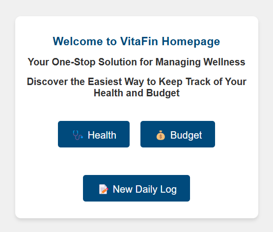

# DataVizProject-VitaFin

## Introduction 
In today’s fast-paced lifestyle, maintaining a healthy balance between physical well-being and financial
stability is increasingly important, especially for students and working professionals. While many
individuals use separate apps to track their fitness and budgeting goals, there is a growing demand
for a single, integrated platform that provides a holistic view of both aspects.

VitaFin is a web-based personal health and budget tracker that addresses this need by combining
health and financial tracking into one unified dashboard. It allows users to manually log health data
(steps, heart rate, sleep hours, and BMI) and financial records (income and categorized expenses),
visualize their data through interactive charts, and monitor trends over time.

What sets VitaFin apart is its integration of benchmark comparison through the use of reference
datasets. For each health metric, users can view their personal trends alongside reference averages
derived from standard sample data. This feature helps users not only see how they are progressing
but also how they compare to healthy norms.

By leveraging Flask for the backend and modern JavaScript (like Vue.js and chart.js) on the frontend,
VitaFin provides a responsive and insightful experience tailored for self-improvement. Whether
the goal is better health or smarter budgeting, VitaFin supports users in building healthier habits
and better financial control—all in one place.

## File Structure and Description

### Frontend

-**index.html** This is the landing page of our application. It shows a welcome message and has
three buttons: ‘Health’, ‘Budget’ and ‘Form’ which are styled using CSS.

-**form.html** This file is the form page of our application. It is accessed when the user clicks the ‘Form’ button on the homepage. It has two tabs, one for Health and the other for Budget. This page allows users to enter their health and budget information using the respective tabs. 

The **Health tab** includes fields like date, weight, height, steps taken, heart rate, and sleep for that day. When the user clicks the Submit button,the data is sent to the database in JSON format. 

The **Budget tab** has fields for date, type (income or expenditure selected from a dropdown), and if ‘expenditure’ is selected, another
dropdown appears to choose the expense category like food, household, apparel, transportation, or other. It also includes fields for amount and description.

   
   
   

-**health.html** This file serves as the Health Tracking Dashboard for our application. It provides users with an interactive interface to visualize their personal health metrics over time. The page features a date picker and three view selection buttons (Daily, Monthly, Yearly) that
allow users to adjust the time range of displayed data.

-**‘visualizer-health.js** This JavaScript file contains the core functionality for the Health Tracking Dashboard using Chart.js. It manages data fetching, processing, and visualization of health metrics across different time periods.

## Setup/Run instructions

- Clone the repo and unzip the folder.
- Open the terminal at the folder and give : flask run --host=0.0.0.0 --port=5000

